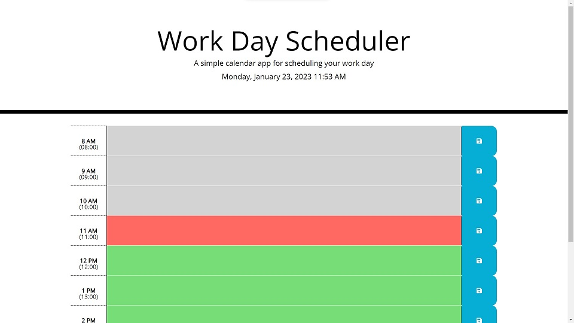

# Third-Party APIs: Work Day Scheduler

A simple calendar application that allows a user to save events for each hour of the day.
This app will run in the browser and feature dynamically updated HTML and CSS powered by jQuery and use the Moment.js library to work with date and time.

* Display the current day at the top of the calender when a user opens the planner.
 
* Present timeblocks for standard business hours when the user scrolls down.
 
* Color-code each timeblock based on past, present, and future when the timeblock is viewed.
 
* Allow a user to enter an event when they click a timeblock

* Save the event in local storage when the save button is clicked in that timeblock.

* Persist events between refreshes of a page

please visit with below url : https://kenny852.github.io/work-day-scheduler/

